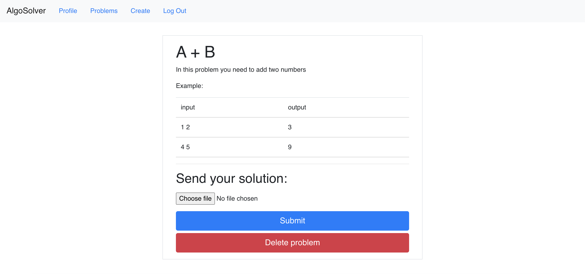

# AlgoSolver: React-based website for competitive programming

## Usage:
To install dependencies
```bash
cd react-website
npm install
```
To run
```bash
cd react-website
npm start
```

## Screenshots

### Problem creation page


### Problem view page



### Problem list page


## Authors
- [Maksym Protsyk](https://github.com/maksprotsyk)
- [Yarema Mishchenko](https://github.com/RavenbornJB)
- [Dmytro Lutchyn](https://github.com/dlutchyn)
- [Nazarii Kuspys](https://github.com/nazar1ous)


